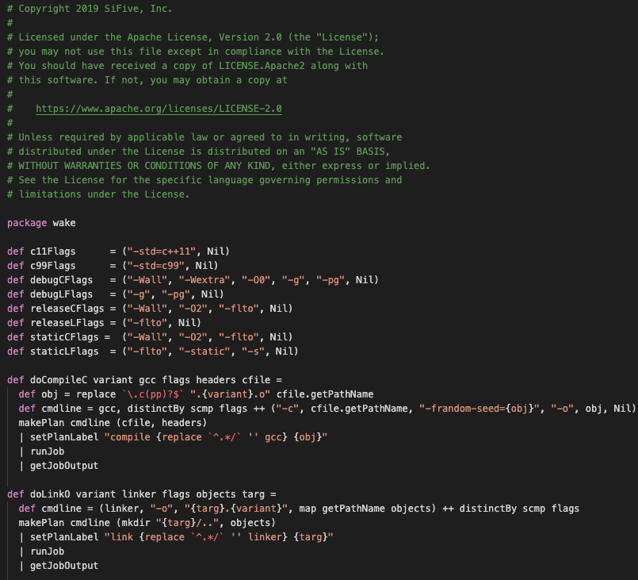

# wake-syntax README

This is the source code for a Visual Studio extension, enabling type checking and syntax highlighting of the Wake language.

## Features

Provides syntax highlighting for *.wake files:

## Requirements

None.

## Extension Settings

None.

## Known Issues

None (so far).

## Release Notes

None (haven't released it yet).

### For more information
* [Visual Studio Code's Language Server Extension](https://code.visualstudio.com/api/language-extensions/language-server-extension-guide)
* [Visual Studio Code's Markdown Support](http://code.visualstudio.com/docs/languages/markdown)
* [Markdown Syntax Reference](https://help.github.com/articles/markdown-basics/)

**Enjoy!**
